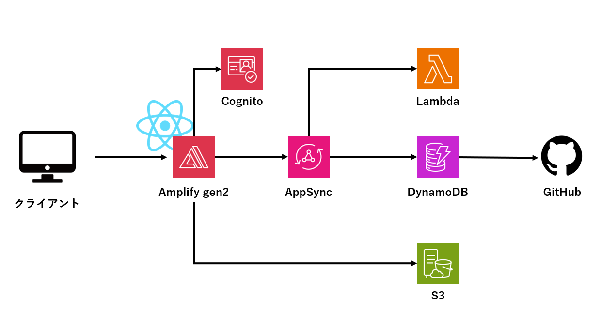

# awsリソースまとめ

- **AWS Amplify Gen2**  
  フロントエンドとバックエンドの統合的な開発・デプロイを可能にするフルスタックな開発プラットフォーム。Gen2ではより柔軟なインフラ定義が可能。

- **AWS Cognito**  
  ユーザー認証・認可を提供するサービス。ユーザーのサインアップ／サインインやSNS連携、トークンベースの認証処理が可能。

- **AWS DynamoDB**  
  フルマネージドなNoSQLデータベース。高スループットでスケーラブルなキー・バリューおよびドキュメント型データストア。

- **AWS AppSync**  
  GraphQL API を簡単に構築・運用できるサービス。DynamoDBやLambdaなどのリソースと連携し、リアルタイム通信やキャッシュもサポート。

- **AWS S3**  
  オブジェクトストレージサービス。画像、動画、ドキュメントなどの静的ファイルを保存・配信可能。ホスティングにも利用される。

- **AWS Lambda**  
  サーバーレスでコードを実行できるコンピューティングサービス。イベント駆動型の処理やバックエンドのビジネスロジックに活用。

## 構成図

